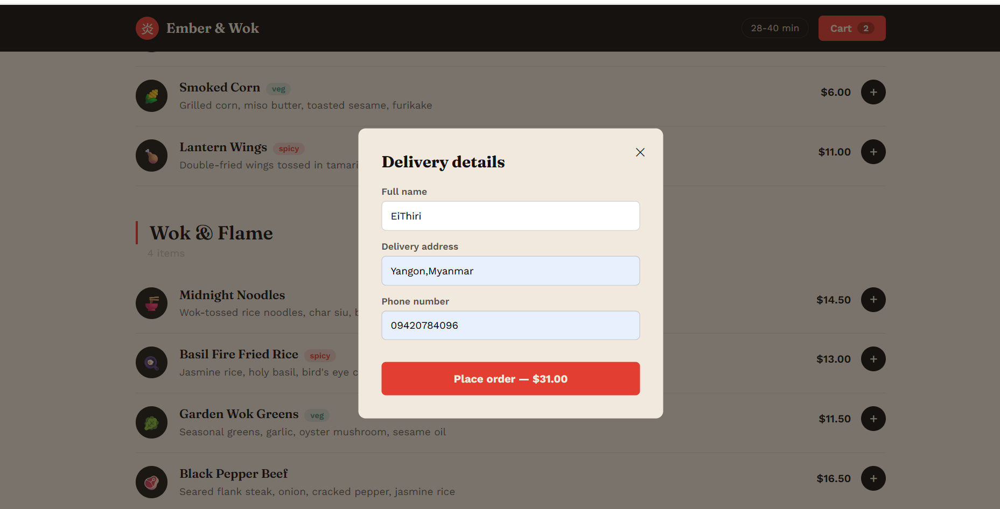
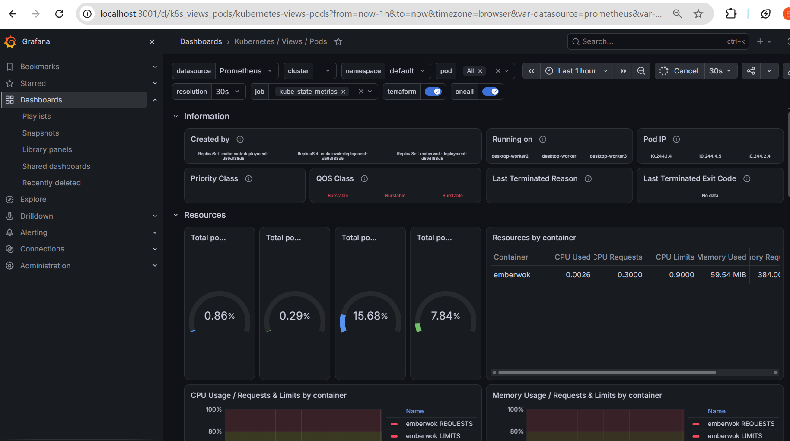
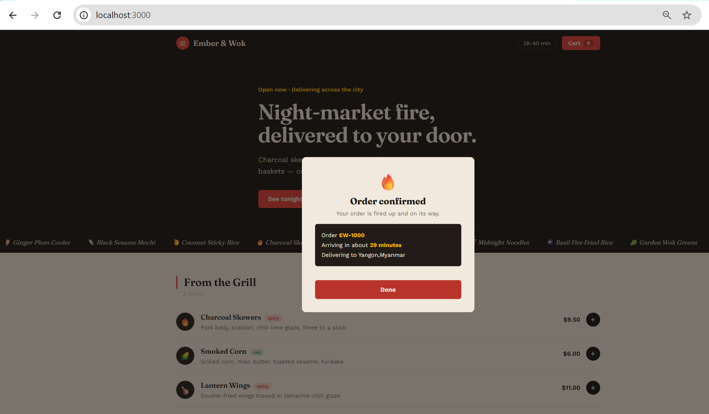

## Food Ordering App
A night-market-themed food delivery app — built as a hands-on DevOps lab covering the full path from local development to a GitOps-deployed Kubernetes service.

**Stack:** Node.js + Express (backend) · Vanilla HTML/CSS/JS (frontend) · Docker · GitHub Actions · GitHub Container Registry · ArgoCD · Kubernetes (k3d)


## What This App Does

Functions about this App:

- Browse a menu across five categories (grill, wok dishes, steam baskets, drinks, desserts)
- Add items to a cart, adjust quantities in a slide-out drawer
- Check out with name, delivery address, and phone number
- Receive an order confirmation with an order ID and estimated delivery time

---

## Project Structure

```
emberwok/
├── .github/
│   └── workflows/
│       └── ci-cd.yml          # GitHub Actions pipeline (test → security → build → deploy)
├── k8s/
│   └── deployment.yaml        # Kubernetes Deployment + Service
├── data/
│   └── menu.json              # Menu content — edit this to change what's on offer
├── public/                    # Front end (served as static files)
│   ├── index.html
│   ├── css/style.css
│   └── js/app.js
├── server.js                  # Express server + API routes
├── package.json
├── package-lock.json
├── Dockerfile                 # Multi-stage container build
├── docker-compose.yml         # One-command local container run
├── .dockerignore
├── .gitignore
└── README.md
```

---

## Architecture

 GitHub Actions (.github/workflows/ci-cd.yml)
      │
      ├─ 1. test      → installs deps, boots the server, confirms /api/menu responds
      ├─ 2. security   → npm audit + secret-scan placeholder
      ├─ 3. build      → builds Docker image, pushes to ghcr.io
      └─ 4. deploy     → rewrites k8s/deployment.yaml with the new image tag,
                          commits and pushes that change back to the repo
      │
      ▼
 ArgoCD (watching k8s/ in this repo)
      │
      ├─ detects the manifest change
      └─ syncs it to the Kubernetes cluster
      │
      ▼
 Kubernetes cluster (k3d)
      │
      └─ 3 pods running the new image, behind emberwok-service
```


---

## Running Locally first to verify UI

```bash
npm install
npm start
```

Open **http://localhost:3000**.

Backend routes:
- `GET /api/menu` — returns the full menu from `data/menu.json`
- `POST /api/orders` — accepts `{ items, customer, total }`, returns an order confirmation
- `GET /api/orders/:id` — look up a placed order (handy for debugging)

Orders are stored in memory and reset when the server restarts — there's no database in this version.

---


## The CI/CD Pipeline

Defined in `.github/workflows/ci-cd.yml`, triggered on every push to `main`. Four sequential jobs:

| Job | What it does |
|---|---|
| **test** | `npm ci`, starts the server, curls `/api/menu` to confirm it actually responds |
| **security** | `npm audit` for dependency vulnerabilities, placeholder secret-scan step |
| **build** | Builds the Docker image, tags it `1.0.<run_number>` and `latest`, pushes both to `ghcr.io/<your-username>/<repo-name>` (lowercased automatically, since Docker registries require lowercase image names) |
| **update_manifest** | Rewrites the `image:` line in `k8s/deployment.yaml` to the new tag, commits with `[skip ci]`, and pushes back to `main` |

### One-time setup required

1. **Settings → Actions → General → Workflow permissions** → **"Read and write permissions"**
   (without this, `update_manifest` can't push its commit back to the repo)
2. After the first successful run: **GitHub profile → Packages → `<repo-name>` → Package settings → Change visibility → Public**
   (new GHCR packages default to private; Kubernetes needs to pull the image without credentials for this lab setup)

No manual secrets are needed — `secrets.GITHUB_TOKEN` is provided automatically by GitHub Actions for every run.

---

## Deploying to Kubernetes with ArgoCD

### 1. Create a local cluster

```bash
k3d cluster create emberwok-lab
kubectl config current-context   # It should show your k3d context
```

(This lab has been run with both `kind` and `k3d` — either works the same way from here on.)

### 2. Install ArgoCD

```bash
kubectl create namespace argocd
kubectl apply -n argocd -f https://raw.githubusercontent.com/argoproj/argo-cd/stable/manifests/install.yaml
kubectl get pods -n argocd -w
```
Wait until all pods show `Running`.

### 3. Access the ArgoCD UI

```bash
nohup kubectl port-forward svc/argocd-server -n argocd 8080:443 > /dev/null 2>&1 &
```
In a second terminal:
```bash
kubectl -n argocd get secret argocd-initial-admin-secret -o jsonpath="{.data.password}" | base64 -d
```
Open `https://localhost:8080`, log in as `admin`.

### 4. Register the app

```bash
argocd login localhost:8080

argocd app create emberwok \
  --repo https://github.com/eithiriphyo/Lab.git \
  --path k8s \
  --dest-server https://kubernetes.default.svc \
  --dest-namespace default \
  --sync-policy automated \
  --self-heal \
  --auto-prune
```

### 5. Verify

```bash
argocd app get emberwok
```
Wait for `Synced` + `Healthy`.

```bash
kubectl get pods -l app=emberwok
kubectl get deployment emberwok-deployment -o jsonpath="{.spec.template.spec.containers[0].image}"
```
kubectl get pods -l app=emberwok
NAME                                   READY   STATUS        RESTARTS   AGE
emberwok-deployment-568cf88d84-49c6h   1/1     Running       0          59s
emberwok-deployment-568cf88d84-5xhck   1/1     Running       0          20s
emberwok-deployment-568cf88d84-x6jhj   1/1     Running       0          36s

### 6. Access the deployed app

```bash
nohup kubectl port-forward svc/emberwok-service 3000:80 > /dev/null 2>&1 &
```
→ **http://localhost:3000** — now served entirely from pods deployed by ArgoCD.

---

## Making a Change and Watching It Deploy

This is the real proof the pipeline works end to end:

```bash
# edit data/menu.json — add or change a menu item
git add data/menu.json
git commit -m "update menu"
git push
```

## Troubleshooting

**`build` job fails: "repository name must be lowercase"**
Docker registries require lowercase image names. The workflow already lowercases the repo name automatically before tagging — if you still hit this, confirm you're using the latest `ci-cd.yml` from this repo (the fix is in the `build` and `update_manifest` jobs).

**`update_manifest` job fails to push**
Check **Settings → Actions → General → Workflow permissions** is set to "Read and write permissions".

**`ImagePullBackOff` in Kubernetes**
Almost always means the GHCR package is still private. Go to Packages → your image → Package settings → set visibility to Public.

**ArgoCD shows `OutOfSync` and never syncs**
Confirm the `--repo` URL is exactly correct and the repo is public (or credentials were added via `argocd repo add` for a private repo).

**Checkout throws `Cannot set properties of null (setting 'textContent')`**
This was a bug in an earlier version of `public/index.html`/`app.js` where the checkout button's nested price span got wiped out when the button's text changed to "Placing order…". It's fixed in the current version — the label and price are now separate, stable DOM elements.

**Port-forward stops working after a pod restarts**
`kubectl port-forward` binds to a specific pod session; if ArgoCD cycles pods (e.g. after a sync), just re-run the port-forward command.

---

## Monitoring with Prometheus + Grafana

The app exposes a `/metrics` endpoint (order counts, order value distribution, HTTP request rate/latency, Node.js process metrics). See **[monitoring/MONITORING.md](monitoring/MONITORING.md)** for the full Helm-based setup — installs `kube-prometheus-stack`, wires up a `ServiceMonitor`, and includes a ready-to-import Grafana dashboard.

---

## Artifacts for Demo




